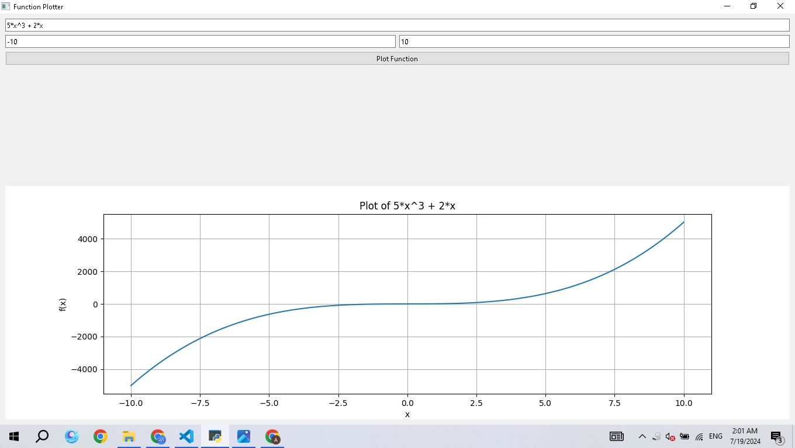
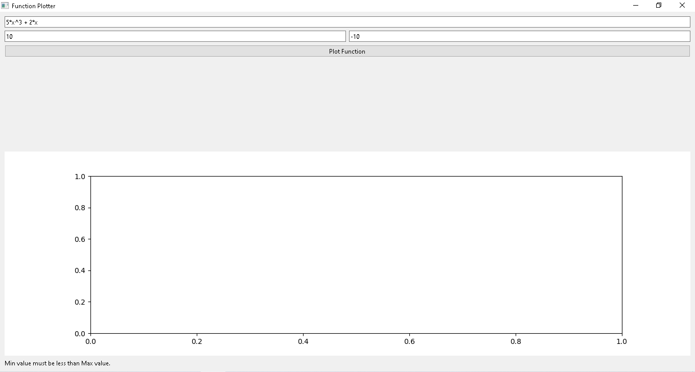

# Function Plotter

## Description

This is a simple function plotter that allows users to input a mathematical function of x, and plots the function over a specified range of x values. The GUI is built using PySide2, and the plotting is done using Matplotlib.

## Requirements

- Python 3.6+
- PySide6
- Matplotlib
- pytest
- pytest-qt

## Setup

1. Clone the repository:
    ```sh
    git clone https://github.com/AhmedNassar7/Master-Micro.git
    cd Function Plotter
    ```

2. Create and activate a virtual environment:

    ```bash
    python -m venv venv
    source venv/bin/activate  # On Windows, use `venv\Scripts\activate`
    ```

3. Install the required packages:

    ```bash
    pip install -r requirements.txt
    ```

## Usage

1. Run the application:

    ```bash
    python main.py
    ```

2. Enter the function, min value, and max value, and click "Plot Function" to see the graph.

## Snapshots

### Working Example



### Wrong Example

