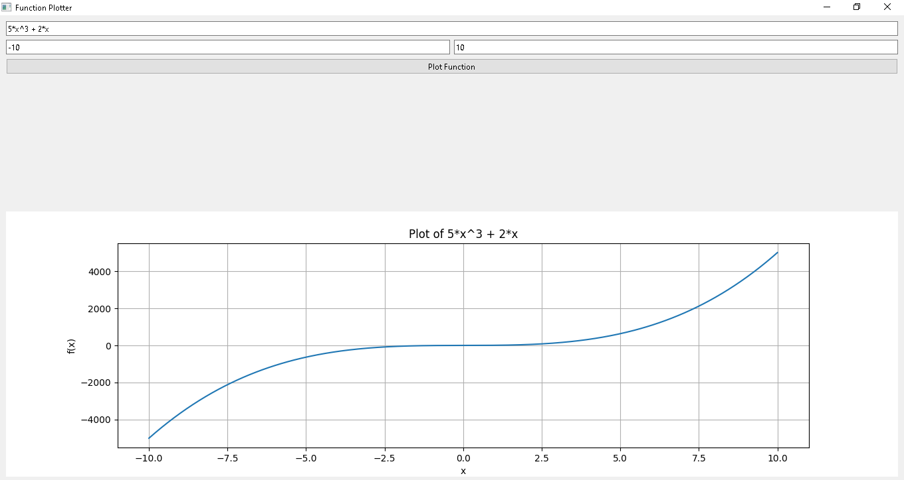

# Function Plotter

This Python GUI application allows users to plot arbitrary functions using PySide2 and Matplotlib.

## Requirements

- Python 3.6+
- PySide6
- Matplotlib
- pytest
- pytest-qt

## Setup

1. Clone the repository:
    ```sh
    git clone https://github.com/AhmedNassar7/Master-Micro.git
    cd function_plotter
    ```

2. Install the required packages:
    ```sh
    pip install -r requirements.txt
    ```

## Usage

Run the application:
```sh
python main.py

## Snapshots

